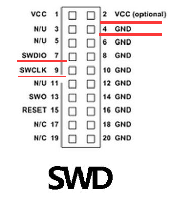
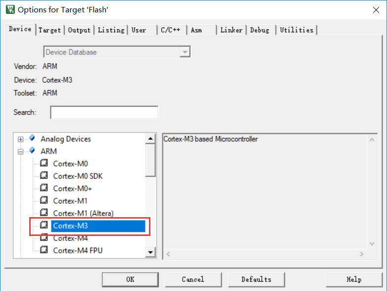
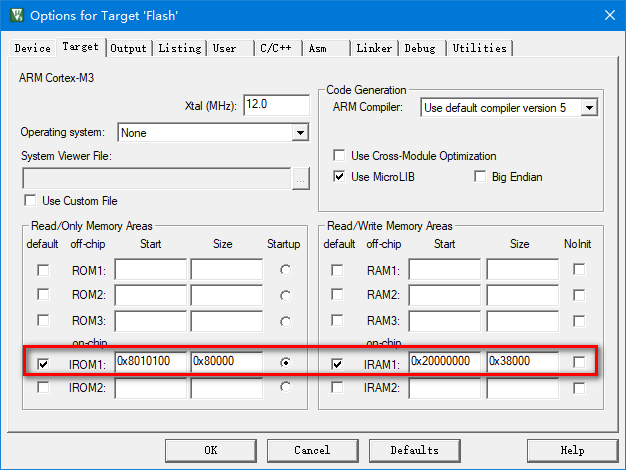
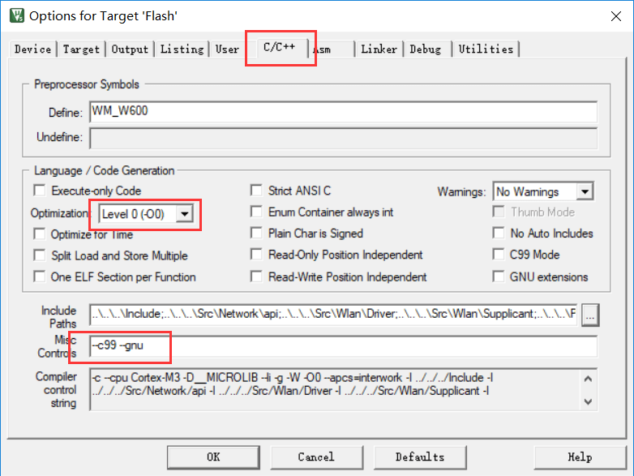
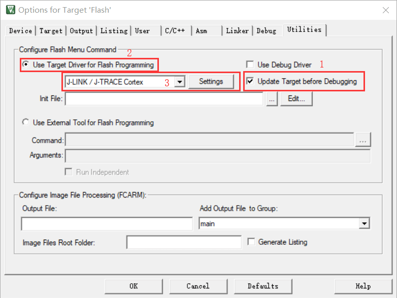
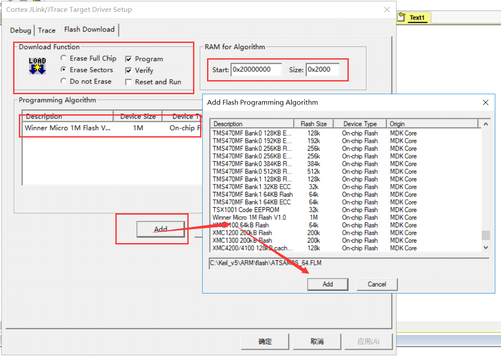
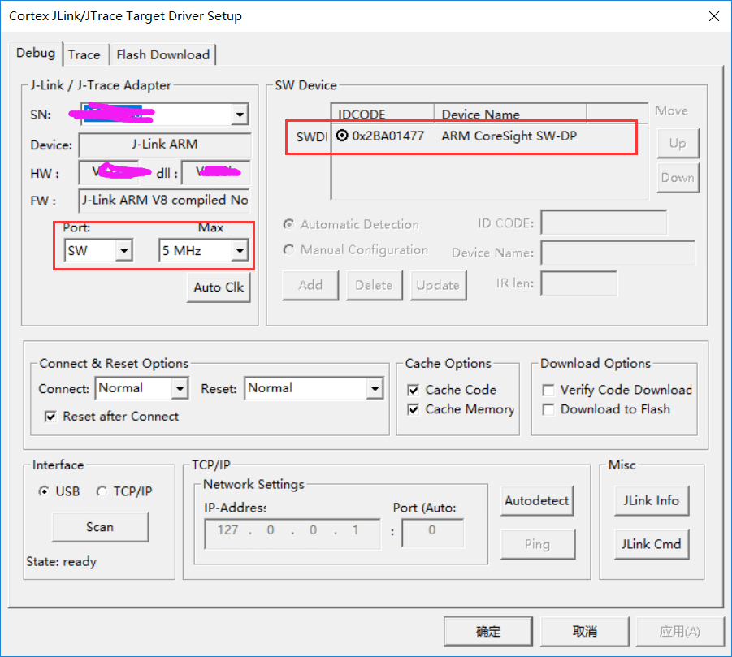
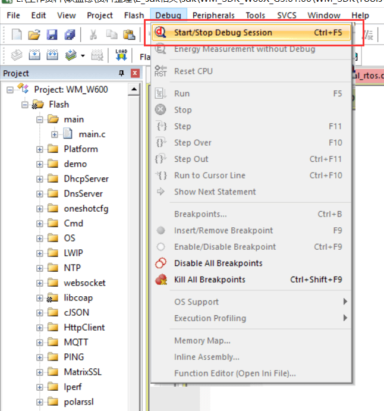
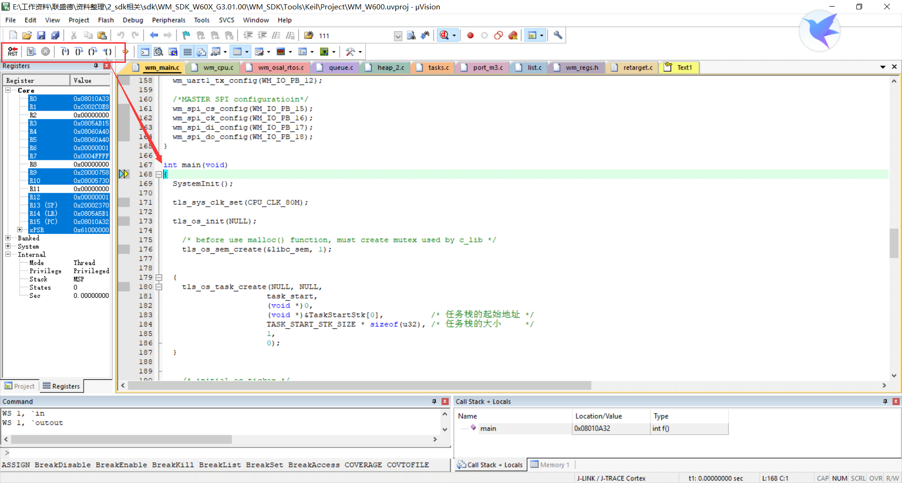

# 基于Jlink的SWD接口调试指南

    注意：部分用户反应无法使用SWD调试W600,是由于FLASH和ROM的地址变更的问题导致。详情参考教程；
    SWD配置过程中出现的Jlink报错问题，请百度自行解决，或者咨询管理员；
    SWD调试过程中建议不要从一开始就执行单步调试，打断点打在相应要查看的地方再执行单步调试。

## 一、准备工作

-   W600\_Keil环境搭建 ：[Soc开发环境搭建指南](../app/ide.md)
-   硬件准备：JLink、TB-01开发板（或者W600系列模组[购买链接]http://shop.thingsturn.com/)）

## 二、QFlash驱动获取与配置

获取QFlash <https://github.com/w600/W600_QFLASH_Driver_for_SWD>

参考Readme.md文件进行编译，获取QFlash驱动（注意，先把W600\_Keil的环境搭建好）

## 三、硬件接口

W600 芯片 32Pin 封装 Pin26（PB6），Pin27（PB7）分别对应 SWDIO（TMS）和
SWCLK （TCK），将芯片的 SWDIO、SWCLK、GND 和 VCC 与调试的 SWD 接口相连。

实物图参考：

## 四、SWD Keil环境配置

### 1.选择芯片

打开Keil工程，芯片默认选择的是Cortex-M3.

工具栏，选择 Project-\>Options for
Target打开对话框，切换到Target标签界面，配置芯片的Flash 和 RRAM 参数

### 2. 配置Flash和RAM地址

工具栏，选择 Project-\>Options for
Target打开对话框，切换到Target标签界面，配置芯片的Flash 和 RRAM 参数。

IROM1: Start-0x8010100, Size-0x80000;

IROM2: Start-0x20000000,Size-0x38000;

注意，配置的地址范围不能超过芯片的实际大小；

### 3.配置优化等级

工具栏，选择 Project-\>Options for Target 打开对话框，切换到C/C++标签界面，如果需要在线调试跟踪程序必须将优化等级设置为 Level0，否则开启优化后的代码实时运行逻辑和实际代码组织结构间存在差异，影响调试。

### 4.调试器选择与配置

保存一下代码到文本，修改名称为ROM.ini(注意要修改文件属性为 .ini );

    FUNC void Setup (void) {
     SP = _RDWORD(0x8010100);           // Setup Stack Pointer
     PC = _RDWORD(0x8010104);           // Setup Program Counter
     _WDWORD(0xE000ED08, 0x8010100);    // Setup VTOR
    }
    LOAD %L INCREMENTAL                 // load the application
    Setup();                            // Setup for Running
    g, _main

选择 Project-\>Options for Target 打开对话框，切换到 Debug
标签界面（按照图示勾选配置）

-   选中 Use，并从下拉框中选择使用的仿真器
-   导入保存的.ini 格式文件，主要完成 SP 和 PC
    指针及中断向量表起始地址的初始化。

注意：SP、PC 和 VTOR 的值与 Flash 配置的起始地址有关，同时芯片不支持在
RAM 中运行程序。

### 5.Utilities 配置

1.  将 W60X Flash 驱动拷贝到 KEI 安装目录的\\ARM\\Flash 目录中2. 选择Project-\>Options for Target 打开对话框，切换到 Utilities 标签界面，按下图选择12，在 3 的下拉框中选择使用的仿真器必须与 Debug标签中的选择

上图中，点击 Setting，如下图 Flash Download 标签中配置 RAM 和 Flash参数必须与前面配置的地址 一致，点击 Add 按钮选择 W60X 芯片的 Flash驱动。[W60x Flash驱动下载地址](https://github.com/w600/W600_QFLASH_Driver_for_SWD)

接上图切换到 Debug 标签，如下图按 1 的方式选择调试器接口，正确检测到W60X 芯片后会显示框 2 中 的芯片信息。

最后选择确定逐级保存所有配置。

## 五、调试

完成 Keil 环境配置，编译程序无误后，选择 Debug-\>Start/Stop Debug Session 或 CTRL+F5，进行程序的在线调试。

## 六、注意事项

由于芯片的 SWD接口复用有其它功能，一旦复用为其它功能则芯片将不支持在线调试功能，此时只能通过串口协议下载合法的固件使用串口调试。
